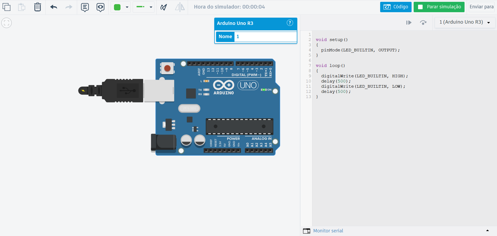
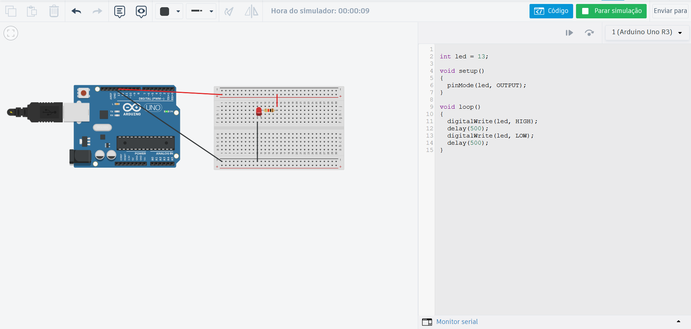

# Primeira etapa - Blink led interno

## Código utilizado:

```arduino
void setup() {
  pinMode(LED_BUILTIN, OUTPUT);
}

void loop() {
  digitalWrite(LED_BUILTIN, HIGH);
  delay(500);
  digitalWrite(LED_BUILTIN, LOW);
  delay(500);
}

```

## Vídeo demonstrativo:

[Vídeo - Interno](assets/led_interno.mp4)

## Representação no Tinkercad:

<p align="center">

</p>

# Segunda entrega - Blink led externo

## Código utilizado:

```arduino
int led = 13;

void setup() {
  pinMode(led, OUTPUT);
}

void loop() {
  digitalWrite(led, HIGH);
  delay(500);
  digitalWrite(led, LOW);
  delay(500);
}
```

## Vídeo demonstrativo:

[Vídeo - Externo](assets/led_externo.mp4)

## Representação no Tinkercad:

<p align="center">

</p>
